

  
  <h1><b>Dades</b></h1>
  
A simple open-source app that prioritizes user privacy and is highly customizable notes with Material You

  

    <a href="docs/CHANGELOG.md">CHANGELOG</a> ·
    <a href="docs/ISSUES.md">KNOWN ISSUES</a> ·
    <a href="CONTRIBUTING.md">CONTRIBUTING</a> ·
    <a href="docs/INSTRUCTION.md">INSTRUCTIONS</a>
  

  

    
    
    
  

  

    
  

> [!warning]
> <b>THIS APP STILL PRE-RELEASE AND IN DEVELOPMENT, SO YOU COULD ENCOUNTER BUGS/ISSUE WHILE USING THIS APP, PLEASE REPORT VIA [Issues](https://github.com/sn00bol/Dades/issues)</b>
> 
> <b>ONLY DOWNLOAD FROM THE LINKS ABOVE. ALL OTHER SOURCES ARE FAKE OR MAY CONTAIN VIRUSES</b>
>
> <b>DADES WILL AND NEVER HAVE ANY SUBSCRIPTION, PAYMENT, OR DONATION METHOD, I WILL NOT RESPONSIBILITY IF YOU DONATE TO UNKNOWN SOURCE</b>

## DESCRIPTION

Designed with a seamless, modern UI built entirely in Jetpack Compose with Material You language design, Dades offers fluid animations and a highly responsive native experience, featuring system-matched Dynamic Color, and extensive custom accent options for deep personalization. Beyond its aesthetics, the app secures your notes with bank-grade encryption by combining SQLCipher for database-level protection with Android Keystore hardware-backed security

### FEATURES
- Encrypt notes and high bank-grade encryption security using SQLCipher and Android Keystore
- Highly customizable notes with theme, color,...
- Will add more!

## SCREENSHOTS

 
          
 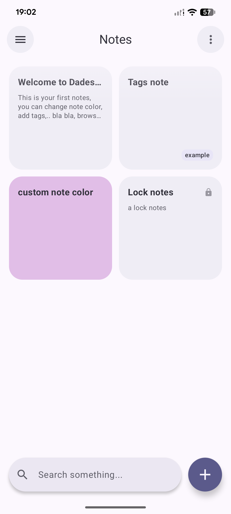
 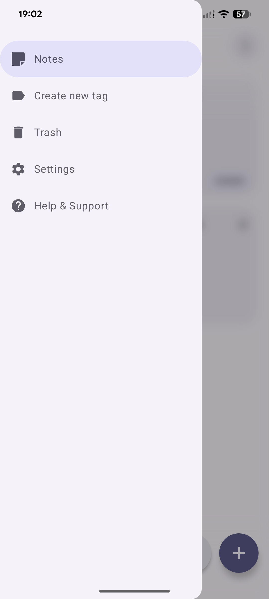
 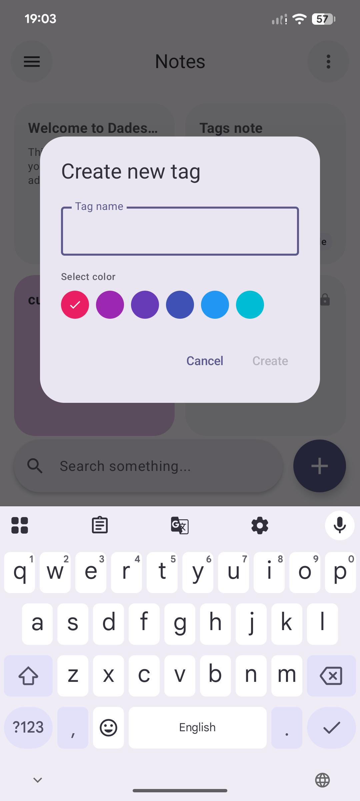
 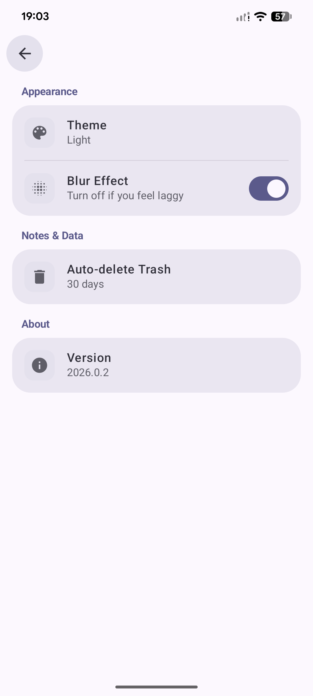
 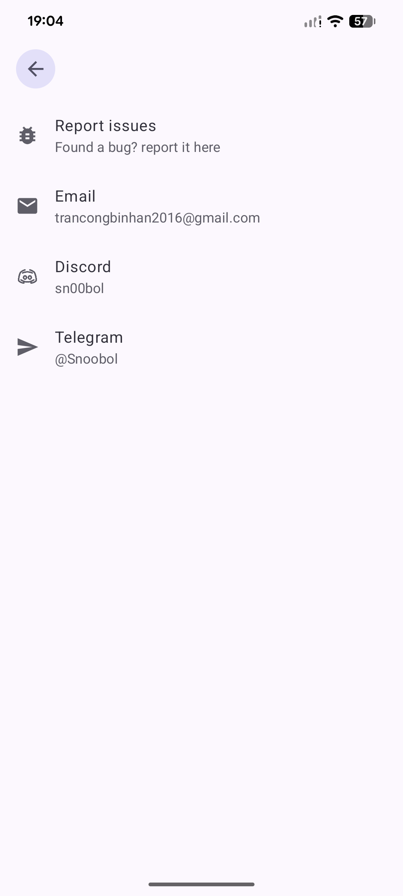
 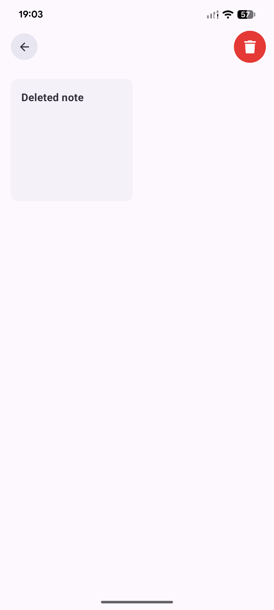
 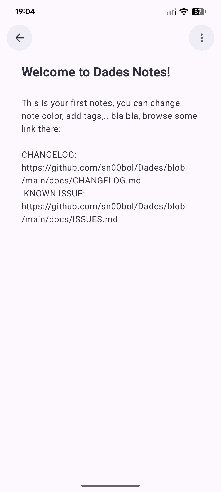
 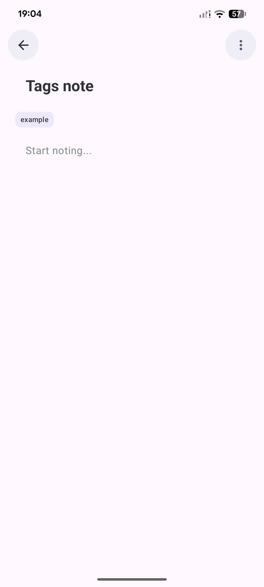
 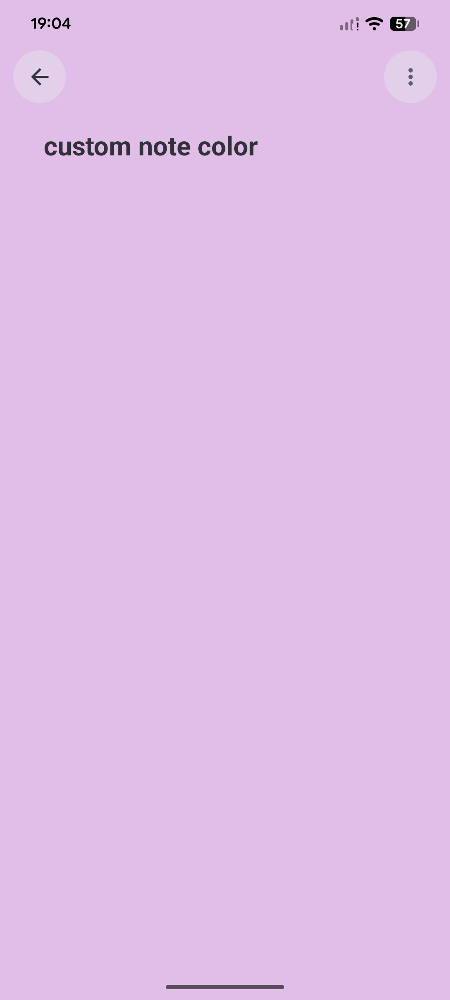
 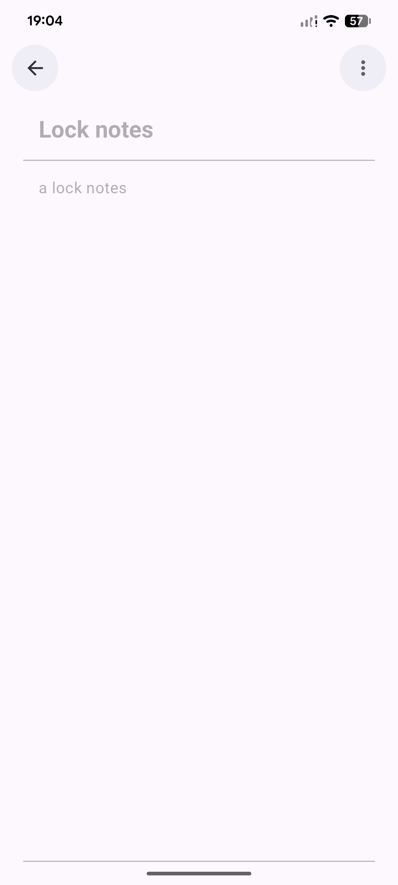
 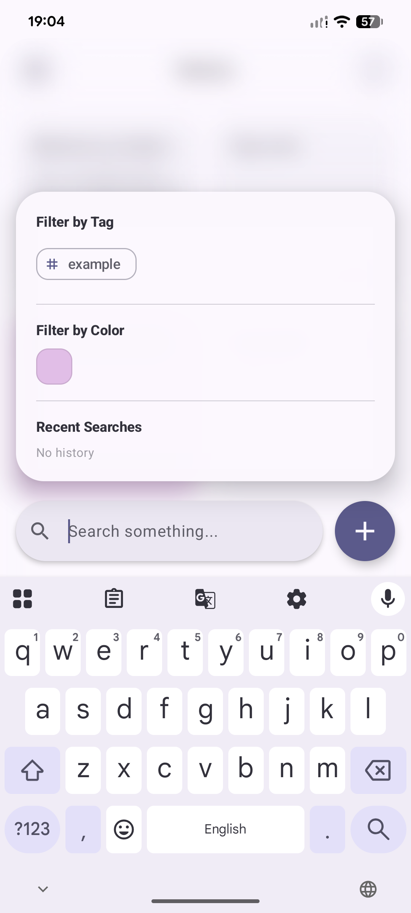
 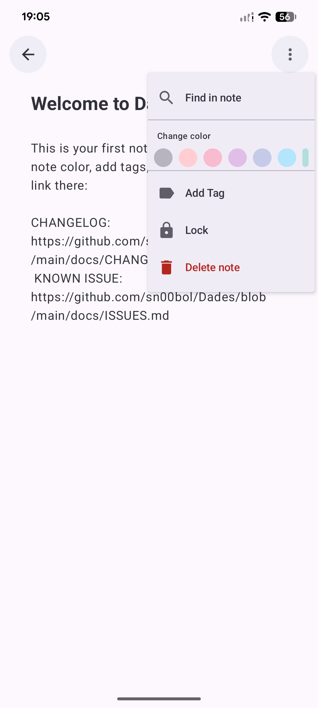

## TRANSLATION

Currently, the app only supports **English**. Localization support and translation contributions will be added in upcoming releases. Stay tuned!

## NEED HELP OR SUPPORT?
* **Email:** [trancongbinhan2016@gmail.com](mailto:trancongbinhan2016@gmail.com)
* **Discord:** [`sn00bol`](https://discord.com/users/870567726324805673)
* **Telegram:** [`Snoobol`](https://t.me/sn00bol)
